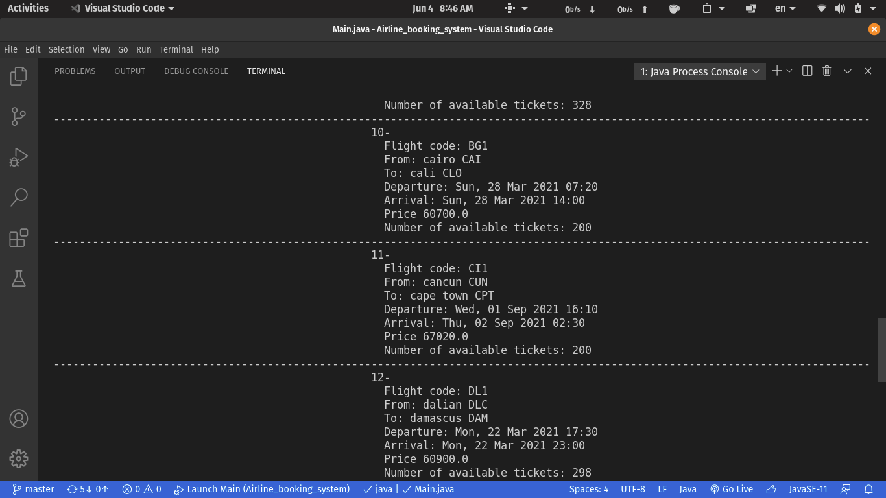
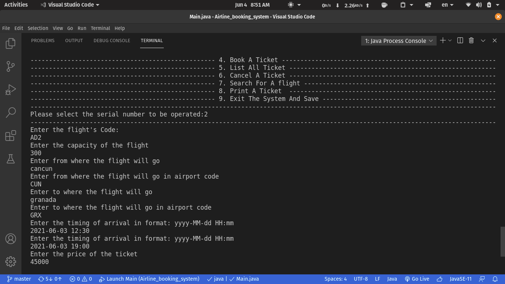
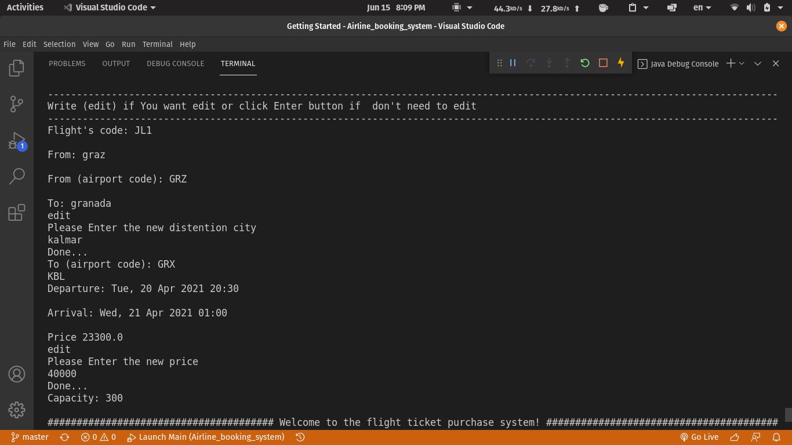
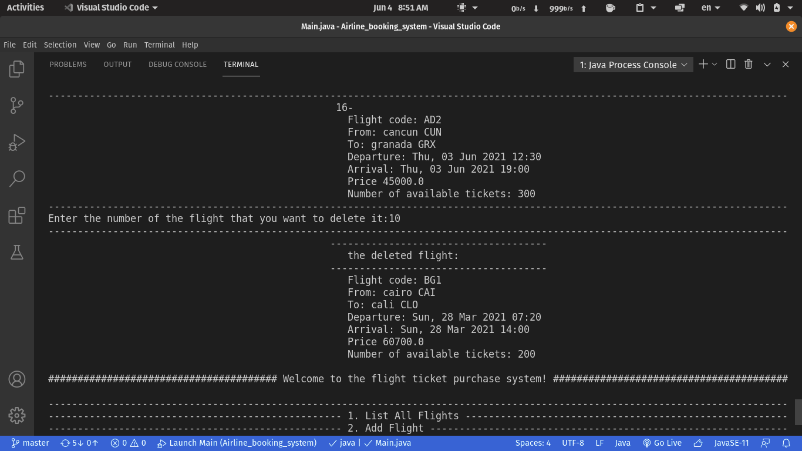
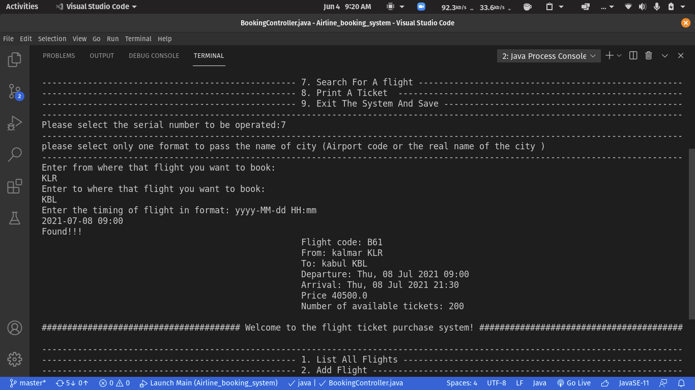
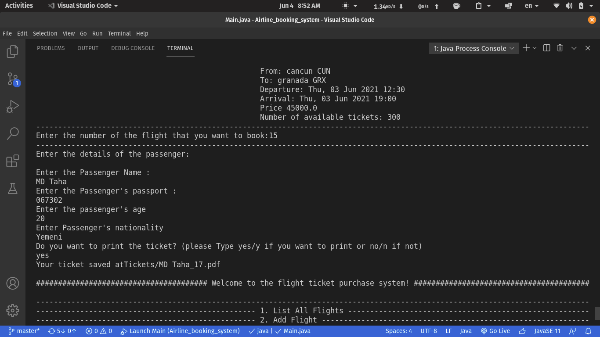
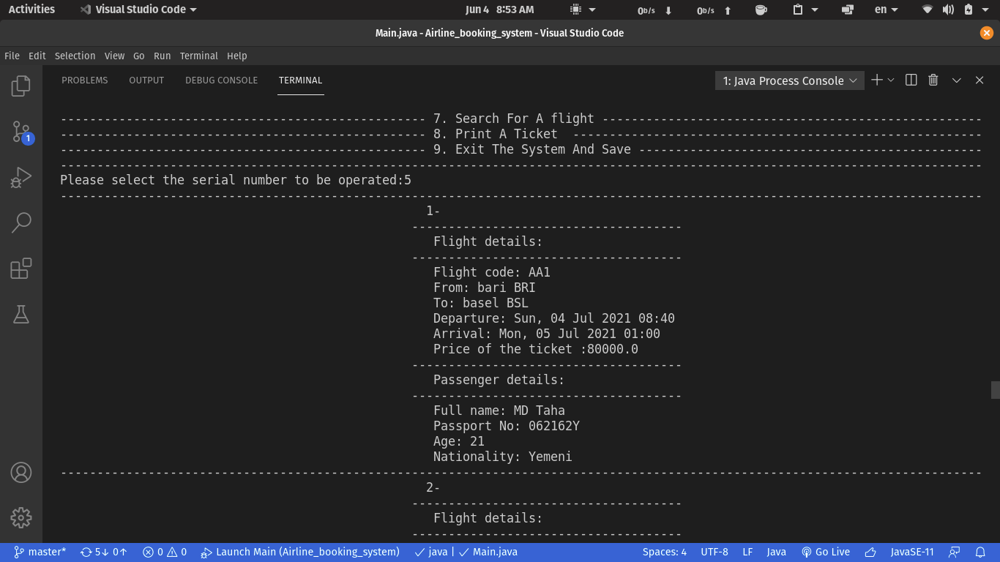
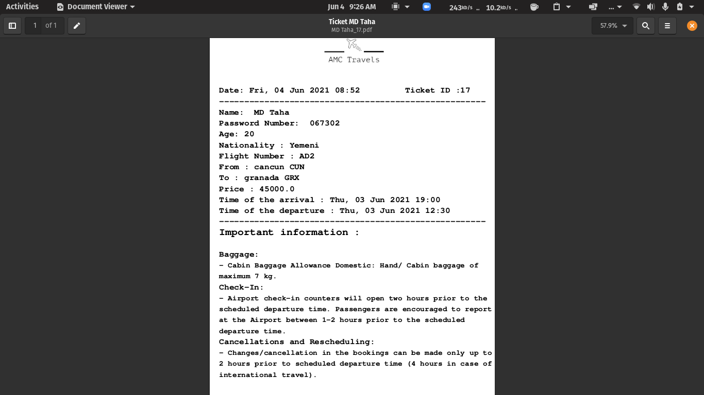
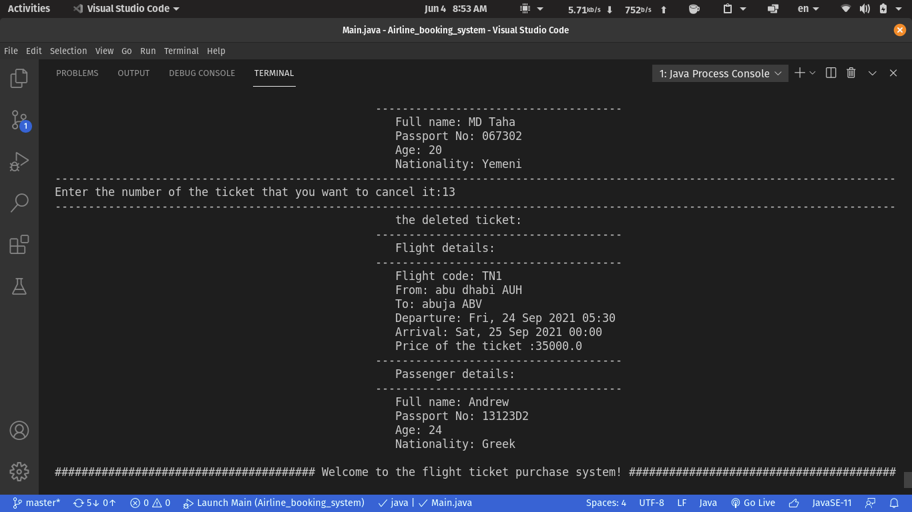

# Airline_booking_system
## This program is for Airline Booking System ,and it made for mini project for subject Object-Oriented Concepts in 2nd year. 
### what this program do :
* ### Load The Old Data From JSON File (using GSON library) and start the program.

* ### List All Flights.

* ### Add Flight.

* ### Edit a Flight.

* ### Delete Flight.

* ### Search For A flight.

* ### Book A Ticket.

* ### Edit A Ticket.
.png)
.png)
* ### List All Ticket.

* ### Print A Ticket As A PDF File (using PDFBox library).

* ### Cancel A Ticket.

* ### Exit The System And Save The Data In the JSON File.
